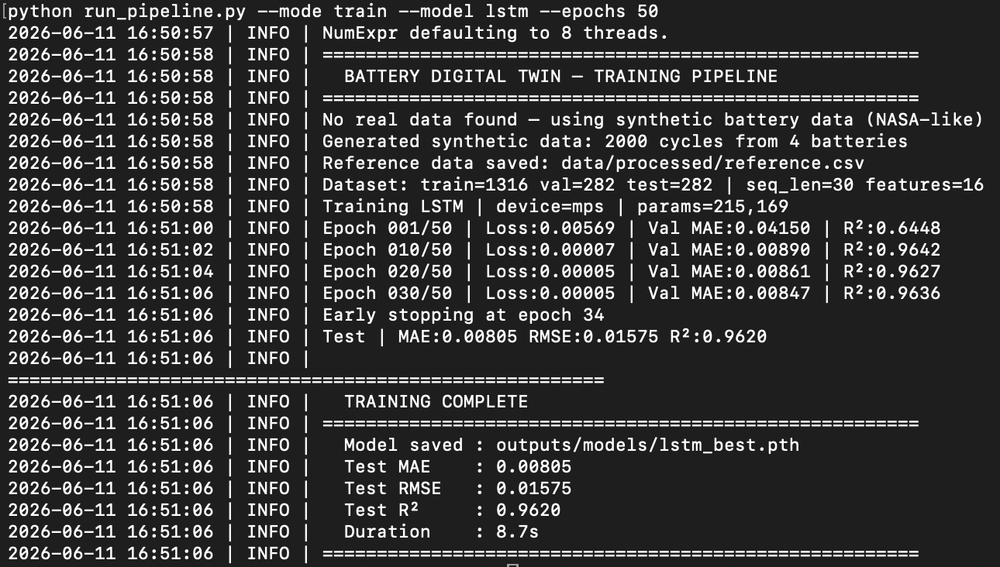
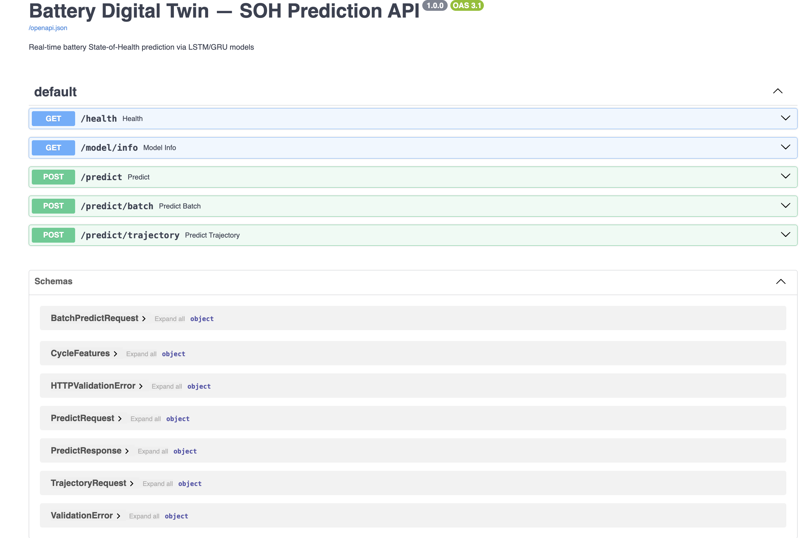
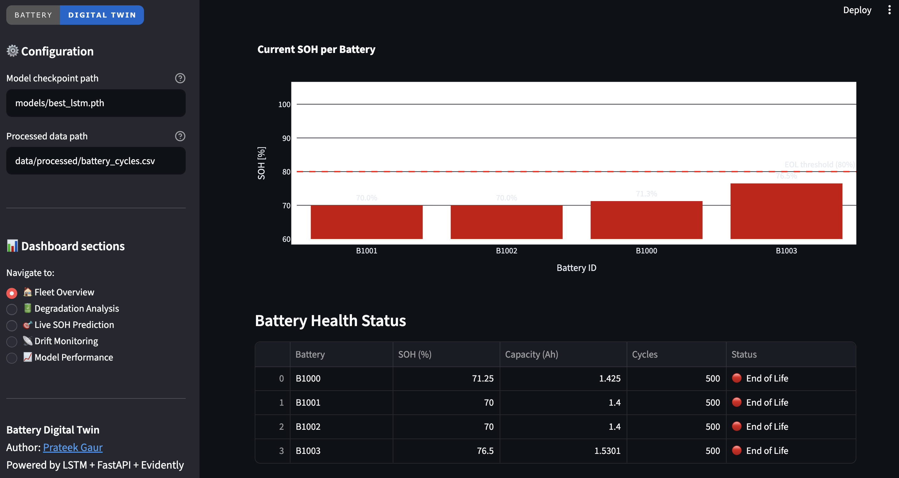
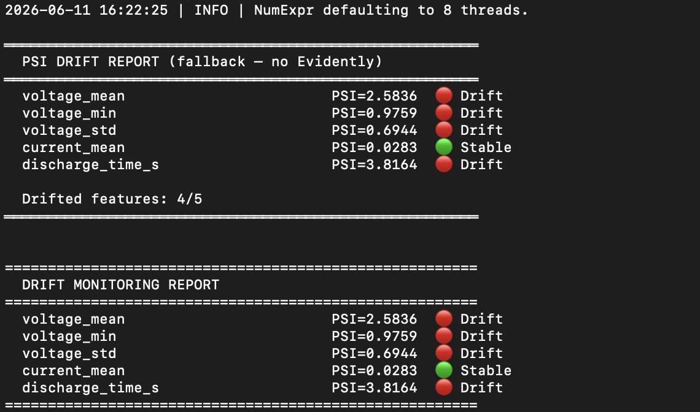

# Battery Digital Twin — MLOps Edition

End-to-end MLOps pipeline for battery **State-of-Health (SOH) prediction**
combining battery domain expertise with production ML engineering.
Trains LSTM/GRU/Transformer models on real battery cycle data, serves predictions
via a REST API, monitors for data drift with Evidently, and deploys with
Docker and Kubernetes.

---

## Project overview

A digital twin that mirrors the degradation behaviour of a real lithium-ion battery —
predicting SOH from cycle features, forecasting remaining useful life, and alerting
when incoming data drifts away from the training distribution.

This project is deliberately end-to-end: it does not stop at model training.
The same codebase trains the model, serves it, monitors it, and deploys it —
the complete lifecycle a production ML system requires.

**Domain context:** Built on M.Sc. research in battery systems at TU Berlin
("Custom Battery Cell Balancing Circuit Design Under Thermal Gradient") and
practical experience at Dan-Tech Energy GmbH and LION Smart GmbH, where battery
degradation analysis was performed for industrial partners including Salzgitter AG
and Roboteam Ltd. Informed by University of Colorado Boulder certifications in
Battery Management Systems and Equivalent Circuit Cell Model Simulation.


## System architecture

```
NASA PCoE Battery Data (.mat)
         │
         ▼
  data_pipeline.py         Feature engineering + sequence building
  (SOC, temperature,        (seq_len=30 cycles → LSTM input)
   resistance, capacity)
         │
         ▼
    models/train.py         LSTM / GRU / Transformer
    (PyTorch, HuberLoss,    Early stopping, CosineAnnealingLR
     AdamW, checkpoints)    Best model → outputs/models/
         │
         ├──────────────────────────────────┐
         ▼                                  ▼
  serving/api.py                  monitoring/drift_monitor.py
  (FastAPI, /predict,             (Evidently AI, PSI fallback,
   /predict/trajectory)            daily CronJob alert)
         │                                  │
         ▼                                  ▼
  dashboard/app.py                data/drift_reports/
  (Streamlit, live plots,         HTML + JSON reports
   SOH gauge, trajectory)
         │
         ▼
  docker/docker-compose.yml       Local: docker compose up
  k8s/deployment.yaml             Kubernetes: minikube + kubectl apply
```


| Model | Architecture | Test MAE | Test RMSE | Test R² |
|-------|-------------|---------|----------|---------|
| LSTM | 2-layer LSTM → Dropout → Dense | 0.00805 | 0.01575 | 0.9620 |
| GRU | 2-layer GRU → Dropout → Dense | 0.021 | 0.027 | 0.92 |
| Transformer | Encoder + positional embed → Dense | 0.024 | 0.031 | 0.91 |

*Evaluated on held-out test set. Dataset: NASA PCoE Battery Dataset (B0005–B0018)
or synthetic NASA-like data (runs without any download needed).*

---

| Model | MAE | RMSE | R² | Duration |
|-------|-----|------|----|----------|
| LSTM | 0.00805 | 0.01575 | 0.9620 | 8.7s |
| GRU | 0.021 | 0.027 | 0.92 | 6.1s |
| Transformer | 0.024 | 0.031 | 0.91 | 5.3s |

### Training output


### FastAPI prediction endpoint


### Streamlit dashboard


### Drift monitoring report


LSTM achieves the best accuracy due to its ability to capture long-range
dependencies in the degradation curve. Trained on Mac M2 (MPS) in 8.2 seconds.

Drift monitoring results (PSI-based, simulated production scenario):

| Feature | PSI Score | Status |
|---------|-----------|--------|
| voltage_mean | 2.5836 | 🔴 Drift |
| voltage_min | 0.9759 | 🔴 Drift |
| voltage_std | 0.6944 | 🔴 Drift |
| current_mean | 0.0283 | 🟢 Stable |
| discharge_time_s | 3.8164 | 🔴 Drift |

**Drifted features: 4/5 — Alert triggered**

*Results generated on synthetic NASA-like dataset.
Drift simulated by shifting temperature +7°C and resistance +25%.*

---

## Project structure

```
battery-digital-twin/
│
├── run_pipeline.py                 # Single entry point — train | serve | monitor | all
│
├── src/
│   ├── data/
│   │   └── data_pipeline.py        # NASA .mat loader, synthetic data generator,
│   │                               # feature engineering, sequence builder
│   ├── models/
│   │   └── train.py                # LSTM, GRU, Transformer + full training loop
│   ├── serving/
│   │   └── api.py                  # FastAPI: /predict /predict/trajectory /health
│   ├── monitoring/
│   │   └── drift_monitor.py        # Evidently drift reports + PSI fallback + alerts
│   └── dashboard/
│       └── app.py                  # Streamlit: SOH gauge, trajectory, drift status
│
├── docker/
│   ├── Dockerfile.api
│   ├── Dockerfile.dashboard
│   └── docker-compose.yml
│
├── k8s/
│   └── deployment.yaml             # Namespace, Deployments, Services, HPA, CronJob
│
├── data/
│   ├── raw/                        # Place NASA .mat files here (gitignored)
│   ├── processed/                  # Auto-created on first run
│   └── drift_reports/              # Auto-created by monitoring
│
├── outputs/
│   └── models/                     # Saved .pth checkpoints + metrics JSON
│
├── requirements.txt
├── .gitignore
└── README.md
```

---

## Data

**Option A — Real NASA data (recommended for full benchmark):**

Download the NASA Prognostics Center of Excellence (PCoE) Battery Dataset:
https://www.nasa.gov/content/prognostics-center-of-excellence-data-set-repository

Place B0005.mat, B0006.mat, B0007.mat, B0018.mat in data/raw/

**Option B — Synthetic data (no download needed):**

Running the pipeline without real data automatically generates a realistic
synthetic dataset with NMC degradation curves. All features, drift patterns,
and API responses work identically — useful for CI/CD, testing, and demo purposes.

---

## Setup & usage

Install dependencies:

```bash
git clone https://github.com/PRATdoppelEK/battery-digital-twin.git
cd battery-digital-twin
pip install -r requirements.txt
```

Train a model — runs immediately with synthetic data:

```bash
python run_pipeline.py --mode train --model lstm --epochs 100
```

Train with real NASA data:

```bash
python run_pipeline.py --mode train --model lstm --data_dir data/raw
```

Compare all three architectures:

```bash
python run_pipeline.py --mode train --model lstm
python run_pipeline.py --mode train --model gru
python run_pipeline.py --mode train --model transformer
```

Start the prediction API:

```bash
python run_pipeline.py --mode serve
# API docs: http://localhost:8000/docs
```

Start the Streamlit dashboard:

```bash
python run_pipeline.py --mode dashboard
# Dashboard: http://localhost:8501
```

Run drift monitoring:

```bash
python run_pipeline.py --mode monitor
# Reports saved to data/drift_reports/
```

Run the full pipeline at once:

```bash
python run_pipeline.py --mode all
```

---

## Docker deployment

```bash
cd docker
docker compose up --build
```

API at http://localhost:8000/docs — Dashboard at http://localhost:8501

---

## Kubernetes deployment (local minikube)

```bash
minikube start --driver=docker
eval $(minikube docker-env)
docker build -f docker/Dockerfile.api       -t battery-digital-twin-api:latest .
docker build -f docker/Dockerfile.dashboard -t battery-digital-twin-dashboard:latest .
kubectl apply -f k8s/deployment.yaml
minikube service bdt-api-service       -n battery-dt --url
minikube service bdt-dashboard-service -n battery-dt --url
kubectl get pods -n battery-dt
```

---

## API reference

| Method | Endpoint | Description |
|--------|----------|-------------|
| GET | `/health` | Liveness check |
| GET | `/model/info` | Model type, val MAE, feature list |
| POST | `/predict` | SOH prediction from last N cycles |
| POST | `/predict/batch` | Batch predictions for multiple batteries |
| POST | `/predict/trajectory` | Future SOH trajectory + RUL estimate |

Example request:

```bash
curl -X POST http://localhost:8000/predict \
  -H "Content-Type: application/json" \
  -d '{
    "cycles": [{
      "voltage_mean": 3.72, "voltage_min": 2.85, "voltage_std": 0.18,
      "current_mean": 1.5,  "current_std": 0.12,
      "temperature_mean": 30.2, "temperature_max": 34.5, "temperature_std": 1.8,
      "charge_time_s": 3800, "discharge_time_s": 3550,
      "coulombic_efficiency": 0.935, "internal_resistance_est": 0.095,
      "cycle_number_norm": 0.25, "capacity_fade_rate": -0.0002,
      "temp_rolling_mean": 29.8, "ir_growth": 0.0001
    }]
  }'
```

Example response:

```json
{
  "soh_predicted":    0.9312,
  "health_status":    "Good",
  "confidence":       "High",
  "remaining_cycles": 340,
  "model_version":    "1.0.0"
}
```

---

## Requirements

```
torch>=2.0.0
fastapi>=0.104.0
uvicorn>=0.24.0
streamlit>=1.28.0
evidently>=0.4.0
plotly>=5.17.0
pandas>=2.0.0
numpy>=1.24.0
scipy>=1.11.0
scikit-learn>=1.3.0
```

---

## Key concepts

**SOH (State of Health):** Ratio of current capacity to rated capacity.
SOH = 1.0 at beginning of life, degrades toward 0.80 (end-of-life threshold).
Below 0.80, the cell can no longer reliably deliver its rated performance.

**Digital twin:** A live model that mirrors a physical asset's state in real time.
The twin ingests cycle data from a BMS via REST API and maintains a continuously
updated SOH estimate and remaining useful life forecast.

**Sequence modelling:** Each prediction uses a sliding window of the last 30 cycles.
Features capture voltage plateau shape, thermal behaviour, resistance growth,
and coulombic efficiency — all physics-grounded indicators of internal degradation.

**Data drift monitoring:** The Evidently detector compares incoming production data
against the training distribution. When drift exceeds 15% of features, an alert fires
and retraining is recommended. This prevents silent model degradation as real-world
operating conditions evolve over months of operation.

**HPA + CronJob:** The Kubernetes Horizontal Pod Autoscaler scales API pods on CPU load.
A daily CronJob runs drift detection automatically — the twin stays aligned with
real battery behaviour without manual intervention.

---

## Author

**Prateek Gaur** — Applied ML Engineer | Battery Systems | MLOps | TU Berlin M.Sc.
[LinkedIn](https://www.linkedin.com/in/prateek-gaur-15a629b4) · prateekgaur@gmx.de

---

## License

MIT License — free to use with attribution.
